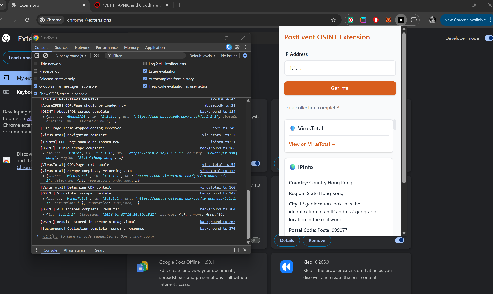

---

## 🎯 Level Reached: Production-Ready Implementation



### What We Achieved

**A fully functional Chrome extension** that automates OSINT data collection from VirusTotal, IPInfo, and AbuseIPDB using Chrome DevTools Protocol (CDP) via `chrome.debugger` API. The solution follows Playwright's abstraction pattern, providing a modular, composable architecture for browser automation.

### Architecture Overview

**Three-Layer Architecture:**

1. **CDP Abstraction Layer** (`modules/cdp/core.ts`)
   - `CDPContext`: Manages debugger attachment/detachment and raw CDP command execution
   - `Page`: High-level API similar to Playwright (goto, click, textContent, waitForSelector, etc.)
   - Abstracts multiple CDP commands into single, intuitive functions

2. **Scraper Layer** (`modules/scrapers/`)
   - Three independent scrapers (VirusTotal, IPInfo, AbuseIPDB)
   - Each uses the Page API to navigate, wait, and extract data
   - Graceful error handling - continues even if selectors fail

3. **Orchestration Layer** (`background.ts` + `popup.ts`)
   - Background service worker creates non-active tabs
   - Parallel execution using `Promise.all` for all three sources
   - Results stored in `chrome.storage.local` for persistence
   - Popup UI displays aggregated results with real-time status

### Core Components

**Communication Flow:**
```
Popup → chrome.runtime.sendMessage → Background Service Worker
                                              ↓
                                    Creates 3 non-active tabs
                                              ↓
                                    Parallel CDP automation
                                              ↓
                                    Stores in chrome.storage.local
                                              ↓
                                    Returns results to Popup
```

**Key Technical Decisions:**
- **TypeScript**: Full type safety across the codebase
- **Non-blocking extraction**: `textContent()` doesn't wait for selectors - tries immediately, returns null if not found
- **Timeout fallbacks**: 5-second timeout on `goto()` if `Page.loadEventFired` doesn't fire
- **Storage polling**: Popup polls `chrome.storage.local` as fallback if `sendMessage` times out
- **Error resilience**: Scrapers continue even if individual fields fail to extract

### Edge Cases & Security Considerations for Future

**Edge Cases to Monitor:**
1. **Rate Limiting**: OSINT sources may rate-limit requests - implement exponential backoff
2. **CAPTCHA Challenges**: Sites may show CAPTCHAs - need detection and user notification
3. **Dynamic Content**: Heavy JavaScript sites may require longer wait times - adjust timeouts per site
4. **Selector Changes**: Website UI changes break scrapers - implement multiple selector fallbacks (already done)
5. **Network Failures**: Handle offline scenarios and partial data collection gracefully

**Security Considerations:**
1. **Input Validation**: Currently validates IP format - should add CIDR range validation and private IP detection
2. **Data Sanitization**: Ensure extracted data is sanitized before display (XSS prevention)
3. **Permission Scope**: `debugger` permission is powerful - consider user consent dialog for first use
4. **Storage Encryption**: Sensitive OSINT data in `chrome.storage.local` - consider encryption for sensitive IPs
5. **API Key Management**: If moving to official APIs, never hardcode keys - use `chrome.storage.encrypted` or secure backend
6. **CSP Headers**: Ensure Content Security Policy doesn't block CDP commands
7. **Tab Isolation**: Non-active tabs are good, but should verify they don't interfere with user's active browsing
8. **Memory Leaks**: CDP contexts must be properly detached - current implementation handles this, but monitor for leaks

**Performance Optimizations:**
- Current parallel execution is optimal
- Consider caching results for repeated IP queries
- Implement request queuing if rate limits are hit
